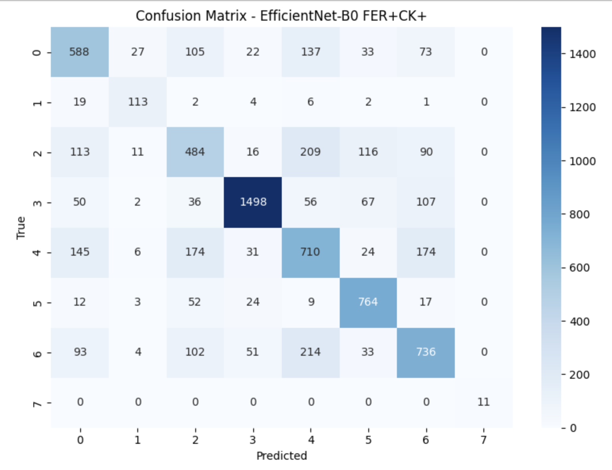
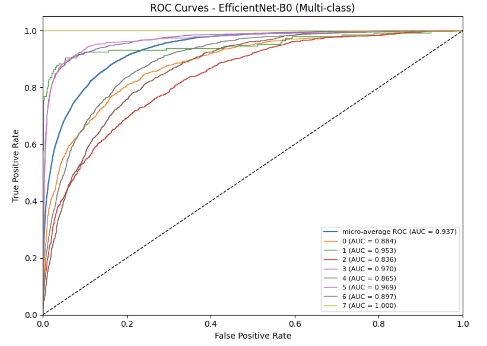
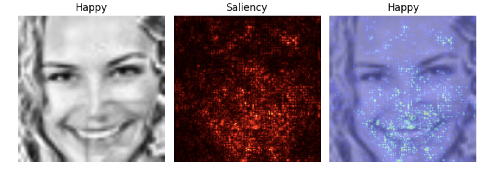
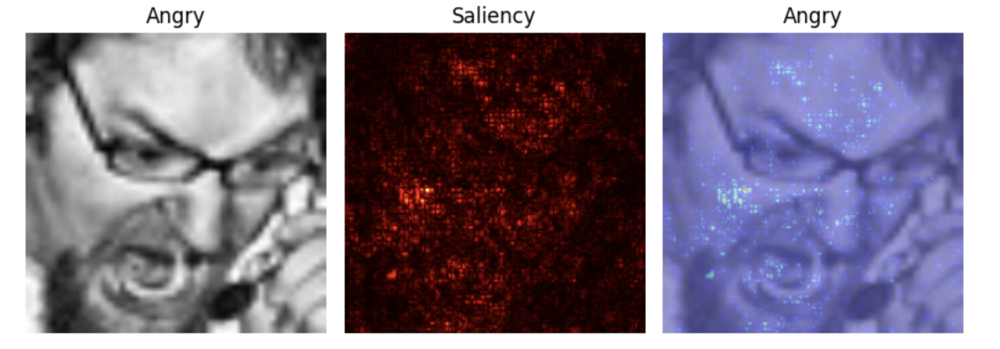

# Emotion-Based Human–Computer Interaction (HCI)

## Overview
This project implements an end-to-end Facial Expression Recognition (FER) pipeline
to enable emotion-aware Human–Computer Interaction systems.

The system classifies **8 facial emotions** using deep learning models and focuses on
robustness, interpretability, and real-world applicability.

Emotion-aware HCI systems can support adaptive learning platforms, mental wellness
monitoring, and intelligent user interfaces.

---

## Models Implemented
- Baseline Convolutional Neural Network (CNN)
- CBAM-Attention CNN (Channel + Spatial Attention)
- EfficientNet-B0 (Transfer Learning with ImageNet weights)
- **Vision Transformer (ViT-B/16)** - Transformer-based architecture with self-attention mechanisms

---

## Key Features
- Face preprocessing with cropping and contrast enhancement
- Handling of class imbalance during training
- Comparison of baseline, attention-based, and transfer-learning models
- Quantitative evaluation using accuracy and class-wise analysis
- Designed for emotion-aware human-centered applications

---

## Results
| Model | Test Accuracy |
|------|---------------|
| CNN | 47.25% |
| CBAM-CNN | 55.98% |
| EfficientNet-B0 | 66.49% |
| **Vision Transformer (ViT-B/16)** | **TBD** (Run notebook to see results) |

The Vision Transformer (ViT) model uses a transformer-based architecture with self-attention mechanisms, which can capture long-range dependencies in facial features. It is expected to achieve competitive or improved accuracy compared to CNN-based models. The model includes:
- Pretrained ImageNet weights for better feature extraction
- Enhanced data augmentation (rotation, color jitter, affine transforms)
- Progressive fine-tuning (last 4 transformer blocks + classifier)
- Advanced training techniques (gradient clipping, cosine annealing with warm restarts)

---

## 📊 Evaluation Visualizations

### Confusion Matrix
The confusion matrix shows class-wise classification performance across all
8 facial emotion categories.



---

### ROC Curve
The ROC curve illustrates the trade-off between true positive rate and false
positive rate for the trained model.



---

## 🔍 Model Interpretability (Saliency Maps)

Saliency maps highlight facial regions that most strongly influence the model’s
predictions, improving transparency and explainability.

### Happy Emotion


### Anger Emotion


---

## Dataset
- FER-2013
- CK+ (Extended Cohn–Kanade)

Datasets are not included in this repository due to license restrictions.

---

## Files
- `emotion_based_hci.ipynb` — complete implementation (training, evaluation, analysis)
- `requirements.txt` — dependencies

---

## 👥 Team and Contribution
This was a group coursework project.

- **Achuth Reddy Bangaru** – Model design and implementation, training and evaluation
  of CNN, CBAM, EfficientNet, and Vision Transformer models, performance analysis
- **Praveen LS** ([@praveen-ls](https://github.com/praveen-ls)) – Data preprocessing,
  dataset handling, and experimentation support

---

## How to Run
```bash
pip install -r requirements.txt
jupyter notebook emotion_based_hci.ipynb

